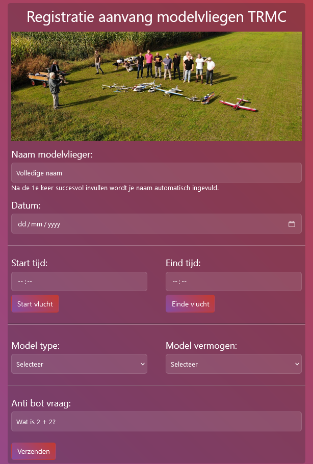
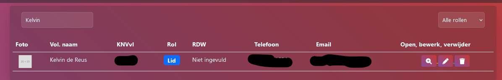
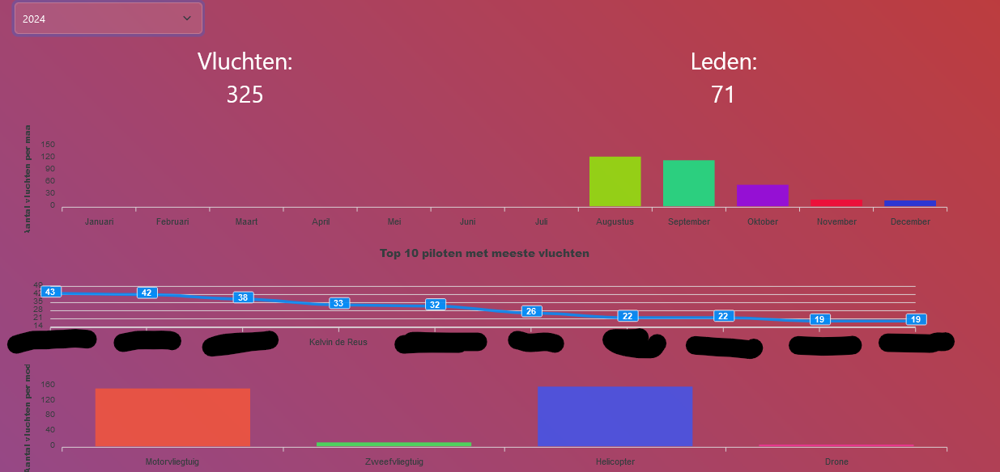

# Kiyomi, an RC club flight manager for T.R.M.C.

Where RC planes and code meet each other.

## Description

A Laravel based application to manage flights, members, send newsletters and many more!

## Features
* Register new flights
* Register as new club member
* Authentication system with password reset
* Show flights and search flights based of name
* Flight statistics (flights each month, top 10 pilots, flight per model)
* Generate flight reports
* Show members and filter by firstname, last name, phone or role
* Add new members
* Newsletter sending (with filters for specific member types)
* Settings page

# Features in development or to be added
* Club finances

## Tech stack
* Laravel
* Livewire
* Nwidart Modules
* Bootstrap
* MariaDB
* Redis

## Screenshots






## Getting Started

### Installation
1) Clone this repo and put it in you're web directory.
2) Change the web directory path to `/public`.
3) Copy `.env.example` to `.env`.
4) Create an database (MySQL or MariaDB) and put the credentials inside `.env`.
5) Change the `APP_URL` in `.env` to your domain.
6) Put in the EMAIL credentials in `.env`.

### Commands to be run

1) Run composer install: `composer install`
2) Generate `APP_KEY` `php artisan key:generate`
3) Migrate the database: `php artisan migrate`

4.1) Seed the database:
```
php artisan db:seed --class=RoleSeeder
php artisan db:seed --class=PermissionSeeder
php artisan db:seed --class=DefaultUserSeeder 
php artisan db:seed --class=LicenceSeeder       
```

4.2 If needed to have demo data:
```
php artisan db:seed --class=Database\Seeders\DemoData
```

5) Login into `https://<domain>/login`
6) Login with: Email: `admin@default.com`. Password: `admin`
7) Change the credentials!

## Help

If encountering any problems:

1) Make sure that `APP_DEBUG` in `.env` is set to `true` so you can see the error.
2) If that is still not working, feel free to create an issue here.

## Authors

ex. [@Kelvin de Reus](https://aerobytes.nl)

## License

This project is licensed under the GNU GENERAL PUBLIC LICENSE Version 3 License. <br> See the LICENSE.md file for details

## Security
If you encounter any security issues, please mail to development@aerobytes.nl.